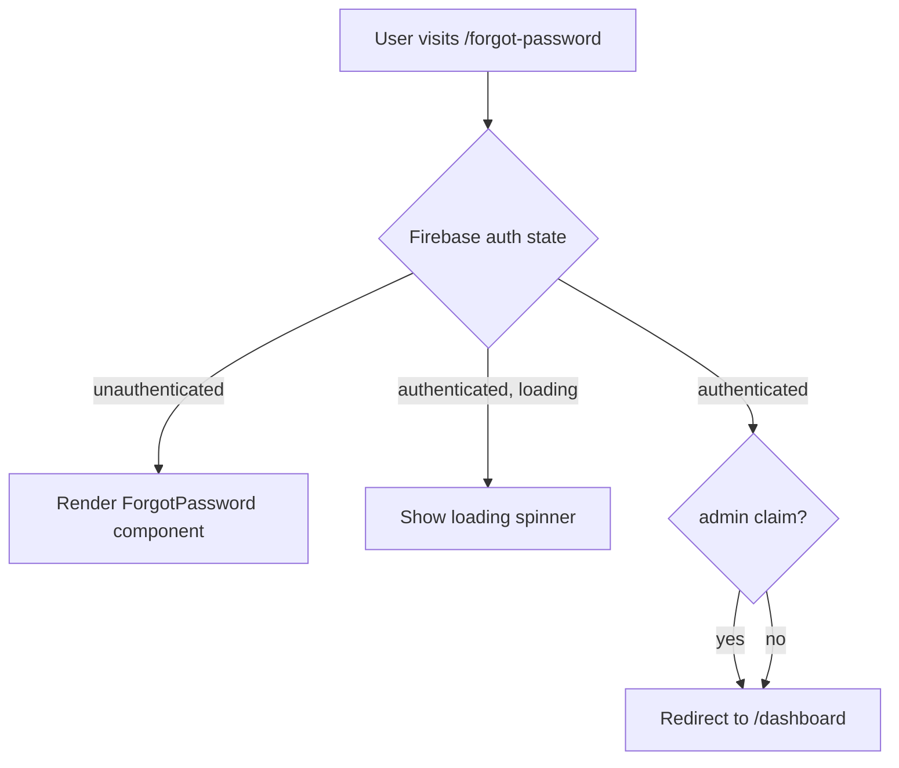
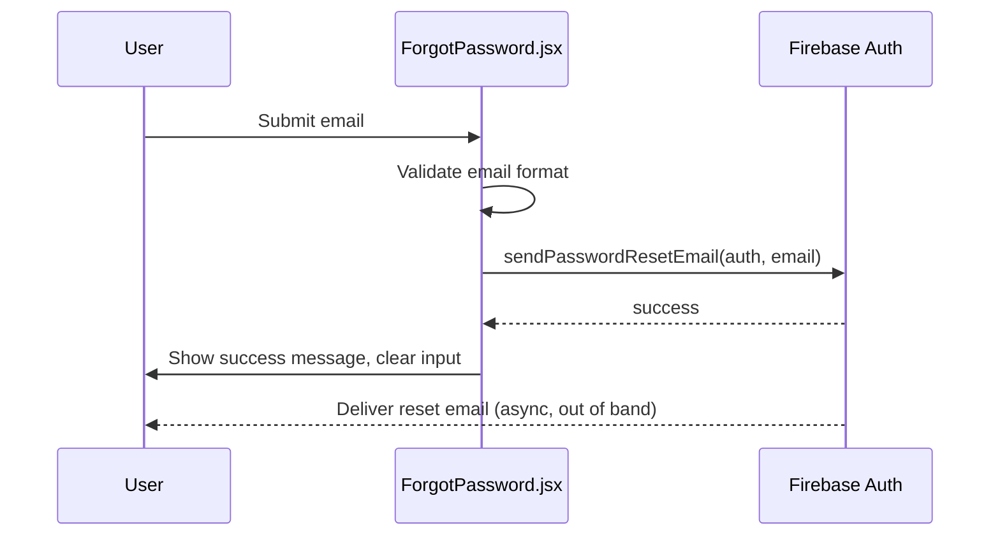

# Design Document: Forgot Password

## Overview

The Forgot Password feature adds a self-service password reset flow to the `nazamly-front` React application. A user who cannot remember their password clicks the "Forgot password?" link on the login page, lands on a dedicated `/forgot-password` route, enters their email address, and Firebase Auth sends a reset link to their inbox.

The feature is entirely client-side: no new backend endpoints are required. It reuses the existing `AuthLayout` card, Firebase Auth configuration (`src/firebase.js`), and CSS classes from `src/styles/Login.css`.

### Key Design Decisions

- **No backend involvement**: `sendPasswordResetEmail` is called directly from the client via the Firebase JS SDK. Firebase handles email delivery.
- **Admin redirect at route level**: Rather than inside `ForgotPassword.jsx`, the admin check lives in the route guard in `App.jsx`, keeping the component free of auth-state concerns.
- **Authenticated non-admin redirect**: Any already-authenticated user (admin or not) navigating to `/forgot-password` is redirected to `/dashboard`, consistent with how `/login` is guarded today.
- **No email enumeration**: Firebase's `sendPasswordResetEmail` does not reveal whether an email is registered. The success message is shown regardless, which is the correct security posture.

---

## Architecture

The feature touches three existing files and adds one new component:

```
nazamly-front/src/
├── App.jsx                        ← add /forgot-password route + guard
├── components/
│   ├── Login.jsx                  ← replace <span> with <Link>
│   └── ForgotPassword.jsx         ← NEW component
└── styles/
    └── Login.css                  ← unchanged (classes reused as-is)
```

### Auth Flow



> Both authenticated admin and non-admin users are redirected to `/dashboard`. Only unauthenticated users see the form.

### Reset Email Flow



---

## Components and Interfaces

### 1. `App.jsx` — Route Guard

A new `ForgotPasswordGuard` component (or inline logic) wraps the `/forgot-password` route. It:

1. Reads `auth.currentUser` from Firebase.
2. If a user is authenticated (regardless of admin status), redirects to `/dashboard`.
3. If unauthenticated, renders `<ForgotPassword />` inside `<AuthLayout>`.

Because `App.jsx` already tracks `user` state and `authLoading` via `onAuthStateChanged`, the guard can reuse those values directly:

```jsx
<Route
  path="/forgot-password"
  element={
    user
      ? <Navigate to="/dashboard" />
      : <AuthLayout><ForgotPassword /></AuthLayout>
  }
/>
```

`AuthLayout` needs a small refactor to accept `children` so it can render `ForgotPassword` instead of the hardcoded Login/Signup toggle. The existing Login/Signup toggle logic stays inside `AuthLayout` when no children are passed (or is passed as children from the `/login` route).

### 2. `Login.jsx` — Forgot Link

Replace the static `<span>` with a React Router `<Link>`:

```jsx
import { Link } from "react-router-dom";
// ...
<Link to="/forgot-password" className="forgot-link">Forgot password?</Link>
```

No other changes to `Login.jsx`.

### 3. `ForgotPassword.jsx` — New Component

**Props**: none (reads Firebase auth directly)

**State**:

| State variable | Type    | Purpose                                      |
|----------------|---------|----------------------------------------------|
| `email`        | string  | Controlled input value                       |
| `error`        | string  | Validation or Firebase error message         |
| `success`      | boolean | Whether the reset email was sent             |
| `loading`      | boolean | Disables form while request is in flight     |

**Behaviour**:

- On submit: validate → call `sendPasswordResetEmail` → set success or error state.
- On success: clear `email`, set `success = true`.
- On error: map Firebase error codes to user-friendly messages (see Error Handling section).
- While loading: disable both the input and the submit button.

**Rendered structure** (CSS classes from `Login.css`):

```
<div className="auth-form-panel">
  <h2>Reset Password</h2>
  <p>Enter your email and we'll send you a reset link.</p>
  <form>
    <div className="form-group">
      <label>Email Address</label>
      <input type="email" ... />
      {error && <span className="error-msg">{error}</span>}
    </div>
    {success && <p className="success-msg">Check your inbox for a reset link.</p>}
    <button className="btn-primary" disabled={loading}>Send Reset Link</button>
  </form>
  <p className="form-footer">
    <Link to="/login" className="forgot-link">Back to login</Link>
  </p>
</div>
```

---

## Data Models

No new data models are introduced. The feature operates entirely on transient React state and delegates persistence to Firebase Auth.

### Relevant existing types (informal)

```ts
// Firebase Auth user (read-only, from auth.currentUser)
interface FirebaseUser {
  uid: string;
  email: string | null;
  getIdTokenResult(): Promise<IdTokenResult>;
}

interface IdTokenResult {
  claims: {
    admin?: boolean;
    [key: string]: unknown;
  };
}
```

### Component state shape

```ts
interface ForgotPasswordState {
  email: string;       // controlled input
  error: string;       // "" when no error
  success: boolean;    // true after successful sendPasswordResetEmail call
  loading: boolean;    // true while awaiting Firebase response
}
```

---

## Correctness Properties

*A property is a characteristic or behavior that should hold true across all valid executions of a system — essentially, a formal statement about what the system should do. Properties serve as the bridge between human-readable specifications and machine-verifiable correctness guarantees.*

### Property 1: Invalid email input is rejected without calling Firebase

*For any* string that is empty, composed entirely of whitespace, or does not match a valid email format, submitting that string in the ForgotPassword form should result in a validation error being displayed and `sendPasswordResetEmail` never being called.

**Validates: Requirements 3.4, 3.5**

---

### Property 2: Valid email is forwarded to Firebase exactly as entered

*For any* string that matches a valid email format, submitting it in the ForgotPassword form should result in `sendPasswordResetEmail` being called exactly once with that exact email string as the argument.

**Validates: Requirements 4.1**

---

### Property 3: Firebase errors produce safe messages and preserve email input

*For any* error thrown by `sendPasswordResetEmail` — whether a network error or any other Firebase error code — the component should display a user-friendly message (either the network-specific message or the generic fallback) and the email input field should retain the value the user entered, so they can retry without re-typing.

**Validates: Requirements 5.2, 5.3**

---

## Error Handling

### Client-side validation errors (before Firebase call)

| Condition | Message |
|-----------|---------|
| Empty or whitespace-only email | "Please enter your email address." |
| Invalid email format | "Please enter a valid email address." |

Validation runs on form submit, not on every keystroke, to avoid premature error messages.

### Firebase errors (after Firebase call)

Firebase error codes are mapped to user-friendly messages. Internal codes are never surfaced to the UI.

| Firebase error code | Displayed message |
|---------------------|-------------------|
| `auth/network-request-failed` | "Network error. Please check your connection." |
| Any other code | "Something went wrong. Please try again." |

Note: Firebase does not return `auth/user-not-found` for `sendPasswordResetEmail` by default (it silently succeeds to prevent email enumeration). If the project has enabled email enumeration protection in the Firebase console, the same generic fallback applies.

### Loading state

While the Firebase call is in flight, both the email input and the submit button are disabled. This prevents duplicate submissions and gives the user clear feedback that the request is being processed.

### Success state

On success, the email input is cleared and a success message is shown in place of (or above) the form. The form remains visible so the user can submit again if needed (e.g., if they mistyped their email and want to resend).

---

## Testing Strategy

### Dual Testing Approach

Both unit/example tests and property-based tests are used. They are complementary:

- **Example tests** verify specific scenarios, edge cases, and integration points.
- **Property tests** verify universal rules across a wide range of generated inputs.

### Property-Based Testing Library

Use **fast-check** (npm package `fast-check`), which integrates naturally with Vitest and React Testing Library.

Each property test must run a minimum of **100 iterations**.

Tag format for each property test:
```
// Feature: forgot-password, Property {N}: {property_text}
```

### Property Tests

**Property 1 — Invalid email rejected without Firebase call**
```
// Feature: forgot-password, Property 1: Invalid email input is rejected without calling Firebase
fc.assert(fc.asyncProperty(
  fc.oneof(
    fc.constant(""),
    fc.stringMatching(/^\s+$/),          // whitespace-only
    fc.string().filter(s => !isValidEmail(s) && s.trim() !== "")  // malformed
  ),
  async (invalidEmail) => { /* render, submit, assert no Firebase call, assert error shown */ }
), { numRuns: 100 });
```

**Property 2 — Valid email forwarded to Firebase**
```
// Feature: forgot-password, Property 2: Valid email is forwarded to Firebase exactly as entered
fc.assert(fc.asyncProperty(
  fc.emailAddress(),   // fast-check built-in email generator
  async (validEmail) => { /* render, submit, assert sendPasswordResetEmail called with validEmail */ }
), { numRuns: 100 });
```

**Property 3 — Firebase errors preserve email and show safe message**
```
// Feature: forgot-password, Property 3: Firebase errors produce safe messages and preserve email input
fc.assert(fc.asyncProperty(
  fc.emailAddress(),
  fc.record({ code: fc.string() }),   // arbitrary Firebase-like error
  async (email, firebaseError) => { /* render, mock Firebase to throw, submit, assert email retained, assert message is one of the two safe strings */ }
), { numRuns: 100 });
```

### Example / Unit Tests

| Test | What it verifies | Requirements |
|------|-----------------|--------------|
| Login renders `<Link to="/forgot-password">` with class `forgot-link` | Link wiring and CSS class preserved | 1.1, 1.3 |
| Unauthenticated user at `/forgot-password` sees ForgotPassword component | Route renders correctly | 2.1, 2.2 |
| Authenticated user at `/forgot-password` is redirected to `/dashboard` | Route guard for non-admin auth users | 2.3 |
| Admin user at `/forgot-password` is redirected to `/dashboard` | Admin route guard | 7.1 |
| ForgotPassword renders email input, "Send Reset Link" button, "Back to login" link | Structural rendering | 3.1, 3.2, 3.3 |
| While loading, input and button are disabled | Loading state | 3.6 |
| On success, success message shown and email input cleared | Success state | 4.2, 4.3 |
| Network error shows "Network error. Please check your connection." | Error mapping | 5.1 |
| Root element has class `auth-form-panel` | Visual consistency | 6.1 |

### Unit Testing Balance

Unit tests cover concrete scenarios and integration points. Property tests handle broad input coverage. Avoid duplicating coverage — if a property test already covers a range of inputs, don't write individual unit tests for each variant.
